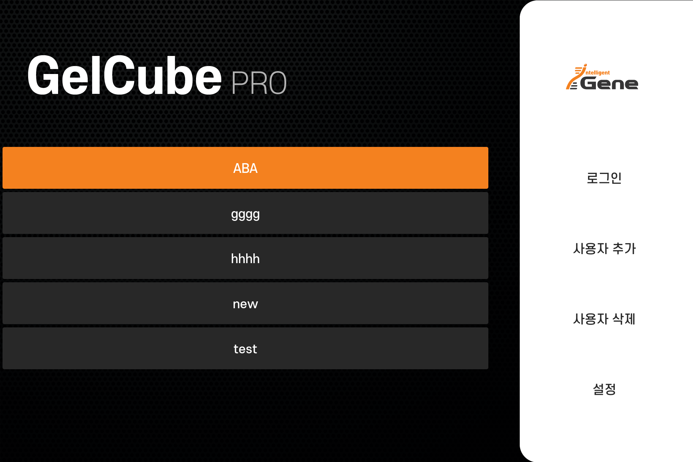
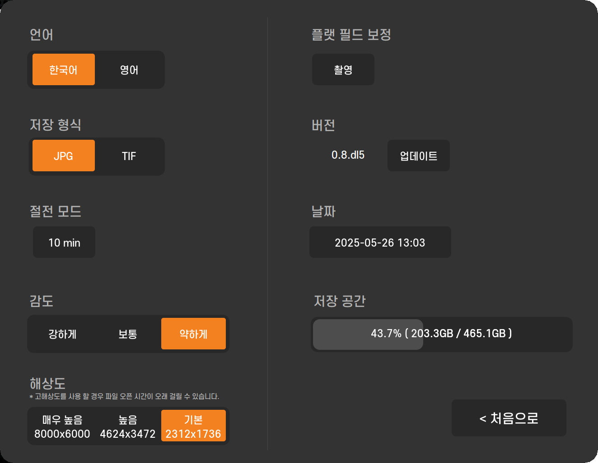
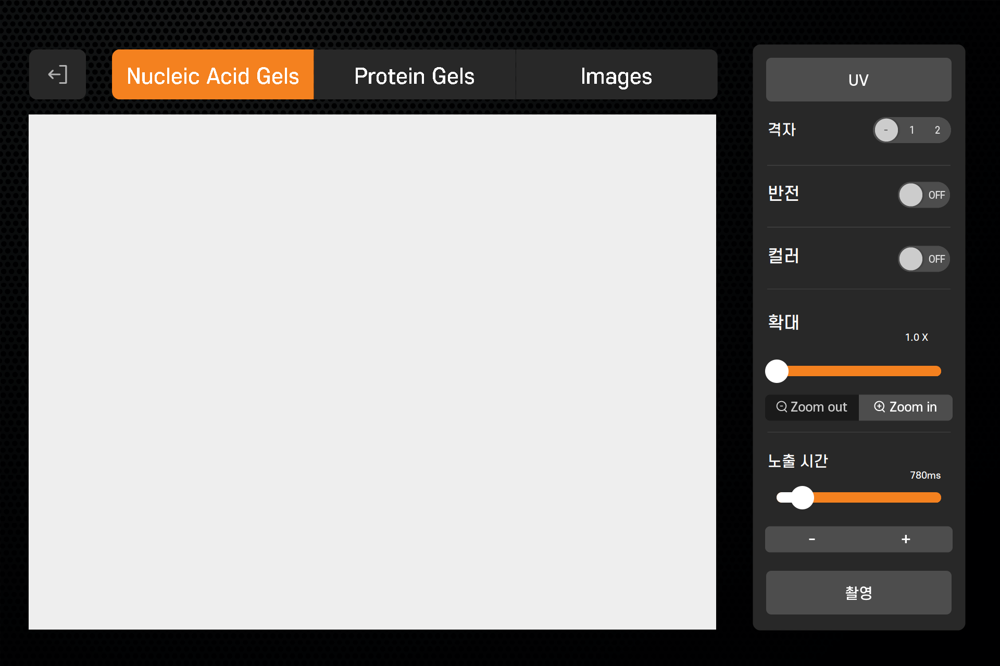
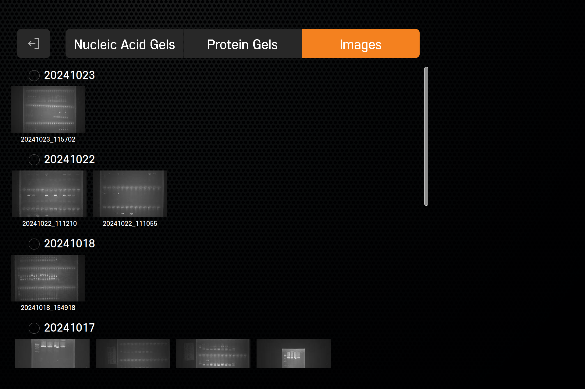
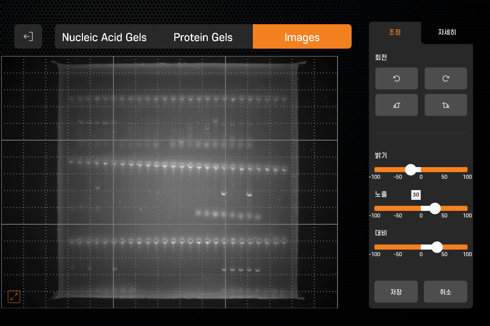

# Real-time Image Streaming Demo (Gel Imaging System)

본 프로젝트는 의료 진단 장비(젤 전기영동 이미지 시스템)에서 사용하는 **Java 기반 GUI 소프트웨어**로,
Python 서버에서 전송된 실시간 이미지를 수신하고 처리하는 구조로 되어 있습니다.

- Java(Swing → JavaFX 전환 고려) 기반의 고성능 GUI
- Raspberry Pi에서 촬영한 이미지를 소켓으로 수신
- 실시간 스트리밍 + 사용자 설정 반영 + 이미지 저장 + 후처리까지 구현
- White Plate 교정, 감도 조절, 노출 시간, 확대/격자, 반전 등 세부 기능 구현
- 실 시스템에서는 JPEG가 아닌 **RAW 스트림** 처리로 더 고해상도 보정 지원
- 최종 사용자 경험에 맞춘 디자인 및 성능 최적화 적용

---

## ⚙️ 시스템 구성 요약

```
[Camera Module (Raspberry Pi)]
    |
    |  Socket (JPEG or RAW over TCP)
    v
[Python Image Sender (picamera2)]
    |
    |  Queue + Compression + Throttling
    v
[Java GUI Receiver (Swing)]
    |
    |  Render to JPanel with optional enhancements
    v
[Final UI - Real-time Control & Save]
```

---

##  주요 기술 요소

- Java (Swing 기반 커스텀 UI, 실시간 이미지 렌더링)
- Python (picamera2, JPEG 인코딩, queue 기반 전송)
- Socket 통신 (TCP, 양방향)
- 실시간 프레임 관리 (스레드 폭주 방지, 대역폭 제어)
- 이미지 최적화 처리
    - White Plate 기반 감도 교정
    - 확대, 반전, 격자, 노출시간 실시간 조절
    - 이미지 저장 (JPG/TIF 선택 가능)
- 향후 JavaFX 등 GUI 개선 고려

---

##  주요 UI 이미지

아래는 실제 Gel Imaging System 장비 UI의 주요 화면 구성입니다. Java 기반 GUI 애플리케이션이며, 실시간 제어 및 이미지 스트리밍, 저장, 편집 기능까지 포함되어 있습니다.

###  로그인 화면


---

###  설정 화면


---

###  실시간 이미지 화면


---

###  갤러리 화면


---

###  편집 화면

