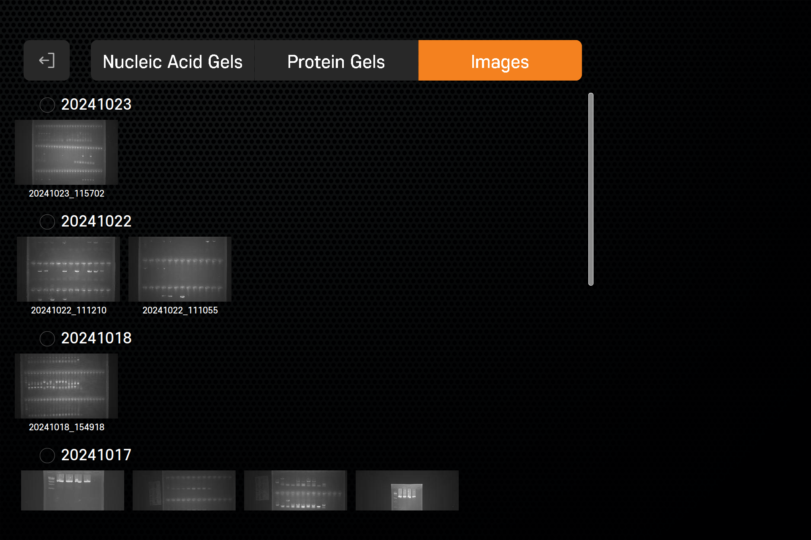

# 🖼️ Real-time Image Streaming Demo

본 프로젝트는 **실제 의료기기 장비 납품 시스템 구조**를 단순화하여 구현한 데모입니다.  
Raspberry Pi 카메라 모듈에서 실시간 JPEG 이미지를 Java 기반 GUI로 전송/렌더링하는 구조를 기반으로 하고 있으며,  
**Python + Java 간 영상 스트리밍 통신**을 어떻게 구성할 수 있는지를 보여줍니다.

---

## 🧩 시스템 구조 (데모 기준)

```text
[ Python 서버 ]
  |
  | (Socket, JPEG Byte Stream)
  |
[ Java GUI 클라이언트 ]
```

> ⚠️ 본 데모에서는 구조를 단순화하기 위해 Python을 서버, Java를 클라이언트로 구성했지만,  
> 실제 시스템에서는 **Java GUI가 서버**, **Python(Raspberry Pi)이 클라이언트**로 동작합니다.  
> Raspberry Pi는 카메라로부터 **RAW 스트림을 수신 및 처리**하고, Java GUI는 명령 제어 및 영상 수신 렌더링을 담당합니다.

---

## 🔧 사용 기술

| 구성 요소 | 기술 |
|-----------|------|
| 통신 | TCP Socket, struct (byte stream) |
| 영상 처리 | PIL (Python), ImageIO (Java) |
| GUI | Java Swing, JLabel |
| 쓰레드 처리 | Java 수신 스레드 → Swing UI 스레드 분리 처리 |

---

## 💡 실제 사용처 및 확장 요소

해당 구조는 **병원 장비용 영상 수신 시스템**의 핵심 구조를 기반으로 구성되었습니다.

### 실 장비 구조 (Java GUI 중심)

- **Raspberry Pi 5 + Python (picamera2)**: RAW 영상 데이터 처리 및 전송
- **Java GUI (Swing 기반)**: 실시간 영상 수신 및 분석, 명령어 전송, 사용자 인터페이스 구성
- **Serial & Socket 병행 통신 구조**: 이미지 수신과 장비 제어 신호 분리

### 포함된 주요 기능
- 📸 **RAW 영상 스트림 기반 전송**
- 🎚️ **노출(Exposure), 게인(Gain) 조절**
- 🎛️ **White Plate Calibration**을 통한 화이트 밸런싱 최적화
- 🧮 **이미지 후처리**: Contrast 보정, Gamma 조정, Histogram Equalization
- 🎯 **프레임 유실 방지 처리**: 수신 Queue 버퍼 최적화 및 FPS 제어
- 🧵 **멀티 스레드 기반 안정화 처리**: GUI, 영상 수신, 영상 처리, 장비 명령 송신 각각 분리

> ✅ 실제 의료기기 (세브란스 외 다수 병원 납품 장비)에 사용된 구조를 기반으로 하며,  
> 본 코드는 구조와 원리를 설명하기 위한 축소형 데모입니다.

---

## ▶ 실행 방법

### 1. Python 서버 실행

```bash
cd python-server
python image_sender.py
```

### 2. Java 클라이언트 실행

```bash
cd java-client
javac ImageClient.java
java ImageClient
```

---
## 📸 주요 UI 스크린샷

아래는 실제 장비 UI의 주요 화면 구성입니다. Java 기반 GUI 애플리케이션이며, 실시간 제어 및 이미지 스트리밍, 저장, 편집 기능까지 포함되어 있습니다.

---

### 🔐 로그인 화면


---

### ⚙️ 설정 화면


---

### 🎥 실시간 이미지 화면


---

### 🖼️ 갤러리 화면


---

### 🧪 편집 화면

