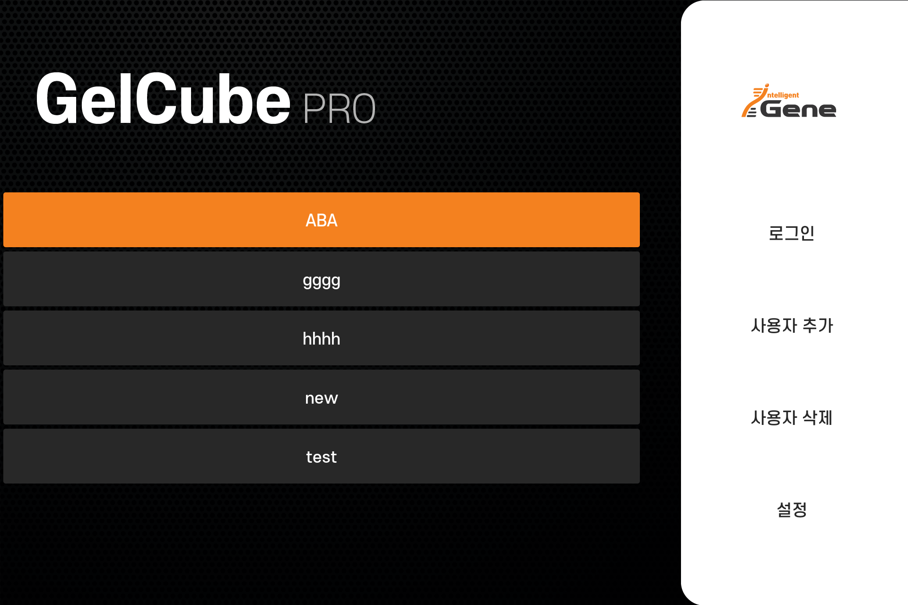
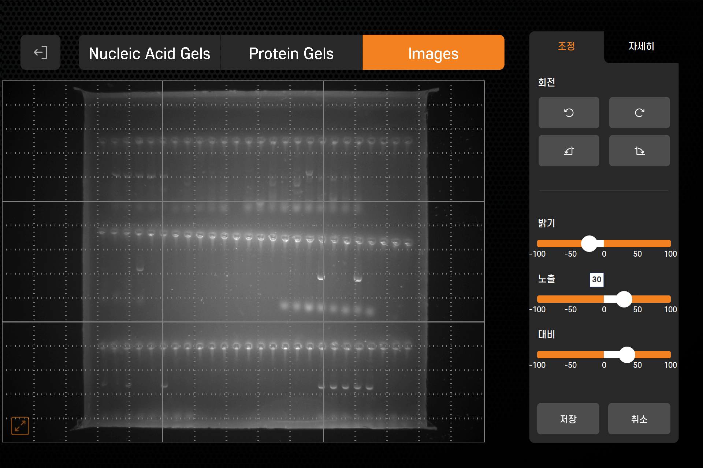

## 📸 주요 UI 스크린샷

아래는 실제 장비 UI의 주요 화면 구성입니다. Java 기반 GUI 애플리케이션이며, 실시간 제어 및 이미지 스트리밍, 저장, 편집 기능까지 포함되어 있습니다.

---

### 🔐 로그인 화면

---

### ⚙️ 설정 화면

---

### 🎥 실시간 이미지 화면

---

### 🖼️ 갤러리 화면

---

### 🧪 편집 화면

